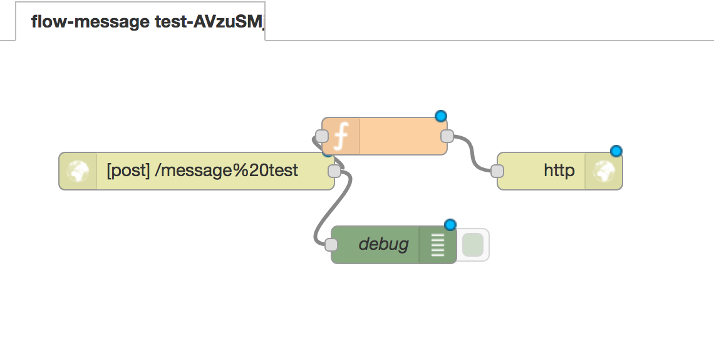

# Ingest API

API for creating and managing data ingest flows to a ES and Node-RED backend

[TODO] talk about flows and flow templates and what are the flow object inside the template
### Flow Template and flows

To create a flow you first need a Template, the template will have some basic information and a flow object, this object is a `flow configuration object` from node-red.

### System parameters

Every parameter starting with an `_` are reserved parameters only used by the system. Currently we only have 3 parameters that can be used without having to add it to the parameter list of you template:

- `_id` : Id generated by ES
- `_name` : just the name used byt the Flow (so you don't have to add it as a parameter)
- `_url` : URL encoded name

## Release History

## Getting Started

### Prerequisites

- [Docker](https://www.docker.com/)
- Yarn

### Configuration

Reasonable defaults are in the `docker-compose`, if you want to customize start there.

There is an environment variable under the API section of the compose file called `ES_INDEX` this allows overwriting where this API stores it's values in ES. This is to allow for multiple of these APIs to run off the same ES cluster.


If left with the defaults, the following will be started:
- ingest-api, on port 4000
- node-red, UI on port 1880
- elastic search, main service on port 9200
- kibana, UI on port 5601

Elastic search will default to writing its database into the `./es-data` on the local filesystem so it will persist unless that directory is cleaned out.

**Warning**: ES wants a gig of ram all to its self, and for you data drive to be under 85% used (it checks!). If either of those aren't available then it won't work right.


### Running

`docker-compose up -d` will start up the full suit of services needed for ingest, including the database.

### Use

The following is assuming you just did a `docker-compose up` and your `es-data` directory was blank...

1. ES will chug away setting things up for a while before you can use kibana normally - you can try the kibana url ( http://localhost:5601 ) while your waiting - it will just give you an error until ES is ready)

2. Once you can get in kibana, you need to setup to look for index of "*" (I.E. everything) and uncheck the timeseries checkbox.

3. Assuming you don't have a leftover database you should only see a few records.

#### Create a Flow Template

1. POST to Ingest API:
    
    ```
           curl -X POST \
             http://0.0.0.0:4000/flowTemplate \
             -H 'cache-control: no-cache' \
             -H 'content-type: application/json' \
             -d '{
             "name": "message-template",
             "description": "Messages can be posted here for storage and future use",
             "parameters": ["message"],
             "flow": {
               "label": "flow-{{_name}}-{{_id}}",
               "nodes": [
                 {
                   "id": "{{_name}}-1-{{_id}}",
                   "type": "http in",
                   "z": "96c7bac4.7985d8",
                   "name": "",
                   "url": "\/{{_url}}",
                   "method": "post",
                   "swaggerDoc": "",
                   "x": 356,
                   "y": 455,
                   "wires": [
                     [
                       "{{_name}}-3-{{_id}}",
                       "{{_name}}-4-{{_id}}"
                     ]
                   ]
                 },
                 {
                   "id": "{{_name}}-2-{{_id}}",
                   "type": "http response",
                   "z": "96c7bac4.7985d8",
                   "name": "",
                   "x": 646,
                   "y": 455,
                   "wires": []
                 },
                 {
                   "id": "{{_name}}-3-{{_id}}",
                   "type": "function",
                   "z": "96c7bac4.7985d8",
                   "name": "",
                   "func": "msg.payload = \"{{message}}\";\n\nreturn msg;",
                   "outputs": 1,
                   "noerr": 0,
                   "x": 506,
                   "y": 427,
                   "wires": [
                     [
                       "{{_name}}-2-{{_id}}"
                     ]
                   ]
                 },
                 {
                   "id": "{{_name}}-4-{{_id}}",
                   "type": "debug",
                   "z": "96c7bac4.7985d8",
                   "name": "debug",
                   "active": true,
                   "console": "false",
                   "complete": "true",
                   "x": 513.5,
                   "y": 514,
                   "wires": []
                 }
               ]
             }
           
           }'
    ```
2. You will receive this in return:

    ```json
    {
        "deprecated": false,
        "name": "message-template",
        "description": "Messages can be posted here for storage and future use",
        "parameters": [
            "message"
        ],
        "flow": "{\"label\":\"flow-{{_name}}-{{_id}}\",\"nodes\":[{\"id\":\"{{_name}}-1-{{_id}}\",\"type\":\"http in\",\"z\":\"96c7bac4.7985d8\",\"name\":\"\",\"url\":\"/{{_url}}\",\"method\":\"post\",\"swaggerDoc\":\"\",\"x\":356,\"y\":455,\"wires\":[[\"{{_name}}-3-{{_id}}\",\"{{_name}}-4-{{_id}}\"]]},{\"id\":\"{{_name}}-2-{{_id}}\",\"type\":\"http response\",\"z\":\"96c7bac4.7985d8\",\"name\":\"\",\"x\":646,\"y\":455,\"wires\":[]},{\"id\":\"{{_name}}-3-{{_id}}\",\"type\":\"function\",\"z\":\"96c7bac4.7985d8\",\"name\":\"\",\"func\":\"msg.payload = \\\"{{message}}\\\";\\n\\nreturn msg;\",\"outputs\":1,\"noerr\":0,\"x\":506,\"y\":427,\"wires\":[[\"{{_name}}-2-{{_id}}\"]]},{\"id\":\"{{_name}}-4-{{_id}}\",\"type\":\"debug\",\"z\":\"96c7bac4.7985d8\",\"name\":\"debug\",\"active\":true,\"console\":\"false\",\"complete\":\"true\",\"x\":513.5,\"y\":514,\"wires\":[]}]}",
        "id": "AVzuORyuvm0PCWanclAD",
        "version": 1
    }
    ```
#### Create Flow

1. POST to Ingest API:

    ```
    curl -X POST \
      http://0.0.0.0:4000/flow \
      -H 'accept: application/json' \
      -H 'cache-control: no-cache' \
      -H 'content-type: application/json' \
      -d '{
        "template": "message-template",
        "name": "message test",
        "description": "Messages can be posted here for storage and future use",
        "parameters": [
            {
                "key": "message",
                "value": "test message"
            }
        ]
    }'
    ```
2. You will receive this in return:
    ```json
    {
        "id": "AVzWNx0pdIscYackLvJD",
        "version": 1,
        "template": "message-template",
        "templateVersion": 1,
        "name": "message test",
        "description": "Messages can be posted here for storage and future use",
        "parameters": [
            {
                "key": "message",
                "value": "test message"
            }
        ],
        "nodeRedId": "8c97b926.e658a8"
    }
    ```

#### Node-RED

If you jump over to your [node-red]( http://localhost:1880 ) you should see a flow defined:



You will notice tha the URL was replaced by a url-encoded version of the name, this because we have a few default parameters that will be passed to the template. See here (TODO).

#### Testing the flow

Now that we used a flow template to create a flow lets go ahead and test sending data to the flow:

```
curl -X POST \
  http://0.0.0.0:4000/flow/message%20test/data \
  -H 'cache-control: no-cache' \
```
returns:

```
test message
```

What is happening here is that the API will execute the flow in node-red that we just created and return the result.

## API

For the API documentation you can go [here](http://0.0.0.0:4000/documentation) when running using the default configuration.

## Running Tests

`yarn test```

***warning*** We are experiencing some errors during test when we try to query some data that ES has indexed yet, this sometimes is solved just running the test again or using an empty database, we still need to make the configuration to run the test on it's own container.

## Future improvements / Shortcomings / Etc.

Here is a list of thing we know we need to add, refactor or remove in the future but we haven't got there yet:

- Increase test coverage
- Run tests inside its own containers
- Refactor model object: mostly move actions to different files and declutter the current implementation.
- Object versioning: we keep the latest version of the object, but ES doesn't do this by default and eventually it will be needed to recreate a Flow that uses and older Template
- Some how enforce always having an input and output http node the the flow template

## Build With

- [hapi](https://hapijs.com/)
- [Docker](https://www.docker.com/)
- [Elasticsearch](https://www.elastic.co/products/elasticsearch)
- [Kibana](https://www.elastic.co/products/kibana)
- [Node-RED](https://nodered.org/)

## Contributing

To make commits against this library see the instructions [here](development.md)

## Authors

* **Luis Malavé** - *Initial work* - [Malave](https://github.com/malave)

## License
See license in [LICENSE.md](LICENSE.md)
